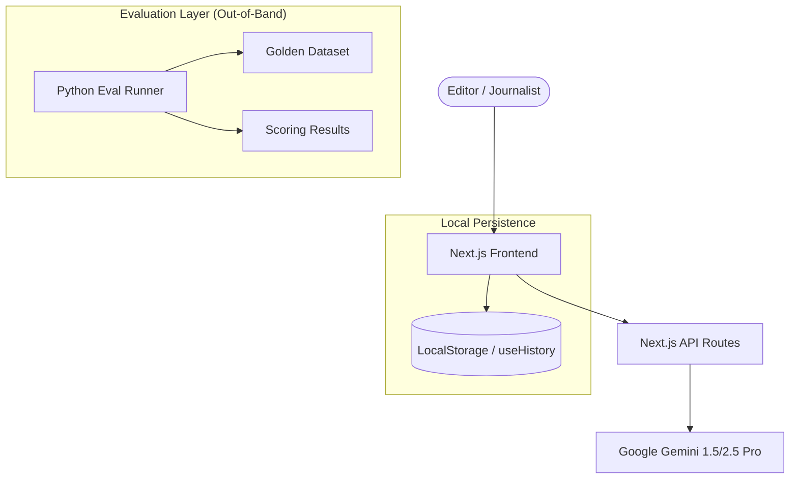

# Forbes Quill: System Architecture

## 1. Executive Overview
Quill is an internal, editorial-grade AI augmentation platform designed for Forbes. It streamlines the transition from raw story angles to researched briefs, article drafts, SEO metadata, and final distribution assets (social/newsletters), all while strictly maintaining the Forbes brand voice.

---

## 2. High-Level Architecture

---

## 3. Core Modules & Workflow

### 3.1 Research Brief Generator
- **Purpose**: Rapidly aggregate context for a story angle.
- **Logic**: Queries Gemini 1.5 Pro to return Key Data Points, Prior Coverage, Story Questions, and Suggested Sources.
- **Verification**: Automatically flags "Key Data Points" and "Sources" for human verification via the **Trust Layer**.

### 3.2 Article Drafting Engine
- **Purpose**: Bridge the gap between research and publication.
- **Logic**: Uses Gemini 2.5 Pro to synthesize research data into a 500-800 word draft adhering to the Forbes style guide.

### 3.3 SEO Metadata Generator
- **Purpose**: Eliminates the manual overhead of metadata creation.
- **Logic**: Analyzes a full article draft to generate optimized headlines, meta descriptions, and tags.

### 3.4 Distribution Hub
- **Purpose**: Formats content for social (X/LinkedIn) and newsletters.
- **Logic**: Translates long-form insights into punchy, platform-specific copy.

---

## 4. Technical Stack

- **Frontend**: Next.js 14, React, Tailwind CSS.
- **AI/LLM**: Google Gemini 1.5 Pro (Research/SEO) & 2.5 Pro (Drafting).
- **Icons**: Lucide React.
- **State Management**: Custom `useHistory` hook with `localStorage` for cross-session persistence.
- **Evaluation**: Python 3.x with a JSON-based "Golden Dataset".

---

## 5. Critical Infrastructure Components

### 5.1 The Trust Layer (`OutputCard.tsx`)
A UI-level safety mechanism that visually flags AI-generated content requiring human fact-checking. 
- **Indicator**: "Verification Required" badge with pulse animation.
- **Trigger**: Passed as a prop to components handling sensitive factual data.

### 5.2 Forbes Brand Voice (`lib/prompts.ts`)
A centralized system prompt ensuring consistent tone:
- **Tone**: Direct, authoritative, slightly impatient.
- **Constraint**: Strict "No AI Fluff" policy (removes words like "delve", "tapestry").

### 5.3 Evaluation Framework (`/evals`)
A multi-tier strategy to measure AI performance against human-verified "Golden" records.
- **Deterministic**: Word count delta, forbidden vocabulary checks.
- **Semantic**: Tag overlap and authority signal matching.
- **Runner**: `eval_runner.py` CLI for automated scoring.

---

## 6. Data Flow: The Guided Funnel
Quill implements a linear editorial funnel:
1. **Research** -> (One-click) -> **Draft Article**
2. **Draft Article** -> (Auto-fill) -> **Generate SEO**
3. **SEO Results** -> (Proceed) -> **Distribution Assets**

This flow is managed via shared state (`incomingDraft`) and CSS-based tab persistence to ensure data is never lost during navigation.
