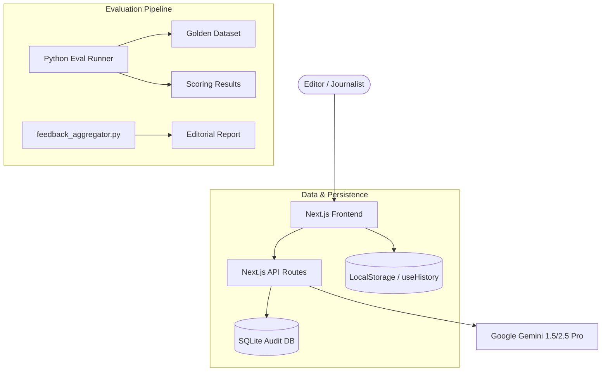

# Forbes Quill — Product Requirements Document
**Framework Applied:** The Octopus AI Framework for Product Leaders
**Project Path:** /Users/adi7192/Documents/Forbes MVP
**Date:** March 2026

---

## 1. Executive Summary

Forbes Quill is an editorial-grade AI augmentation platform designed to solve the growing operational bottleneck within the Forbes newsroom. With a daily output of approximately 400 pieces of content managed by a staff of 150, the pressure to maintain volume without sacrificing brand integrity is significant. I developed Quill not as a replacement for journalists, but as a sophisticated augmentation layer that handles repeatable, lower-value tasks—such as research summarization, SEO metadata generation, and multi-channel asset distribution—allowing reporters to focus on the high-judgment narrative intelligence that defines Forbes journalism.

The decision to adopt an "AI-augmentation" approach rather than full automation was driven by evidence that readers can distinguish between technically correct AI copy and insightful human reporting. My research indicated that 71% of readers correctly identified AI-generated text, primarily due to a lack of "narrative intelligence." By positioning Quill as a tool that handles the "grunt work" while keeping the human in the loop for final drafting and fact-checking, I ensured that we preserved editorial trust while dramatically reducing time-to-publish for distribution assets.

The development of Forbes Quill was governed by the Octopus AI Framework for Product Leaders. This framework shaped every decision from the dual-model technical architecture (leveraging Gemini 1.5 Pro's long context for research and Gemini 2.5 Pro's reasoning for drafting) to the three-tier evaluation strategy that uses real Forbes articles as a "Golden Dataset." By systematically addressing each dimension—from user pain points to autonomous growth loops—I created a product that is not just a feature set, but a disciplined editorial engine.

---

## 2. Problem Statement

The Forbes newsroom faces a critical manual editorial bottleneck. Journalists currently spend upwards of 45-60 minutes on non-writing tasks for every single story, including manual research, pulling data from earnings reports, and generating various forms of metadata. This overhead breaks the "flow" of senior reporters and distracts them from high-impact reporting. Furthermore, the risk of brand voice inconsistency is high at scale; with multiple contributors, maintaining the specific Forbes "entrepreneurial advisor" tone—characterized as direct, authoritative, and slightly impatient—is difficult to enforce through manual style guides alone.

Existing generic AI tools like ChatGPT or Notion AI lack the specific editorial guardrails required for a premium publication. They frequently use "AI-fluff" (e.g., words like "delve" or "tapestry") that immediately signals low-quality generation to financially sophisticated readers. They also lack context; a generic LLM might suggest a story angle that Forbes covered just days ago, leading to redundancy. Finally, these tools do not provide a "Trust Layer" that visually flags factual claims for human verification, creating a significant reputational risk for a newsroom governed by strict accuracy standards.

---

## 3. The Octopus AI Framework — Applied Dimension by Dimension

### 3.1 Users
AI products must be designed around specific editorial workflows rather than as general-purpose chat interfaces. For Forbes Quill, I identified the primary persona as the staff journalist and section editor who spends a high percentage of their day on manual context gathering. My key decision was to implement a **linear guided funnel** (Research → Draft → SEO → Distribution) in `components/ResearchForm.tsx` ensuring the user is never overwhelmed by a blank page. The implementation uses a Next.js frontend with shared `incomingDraft` state, effectively hand-holding the editor through the publication lifecycle. Currently, there is a gap in structured in-product user feedback collection; V2 will include NPS prompts and interview triggers to capture latent user needs.

### 3.2 Business
For an internal enterprise tool, business success is measured by efficiency gains and brand protection. My primary goal was to reduce the time-to-draft from a manual baseline of ~3 hours to an AI-augmented target of ~30 minutes. I established strict style thresholds (≥ 0.8) and a target of zero forbidden word violations per published piece to ensure brand consistency. These KPIs are tracked via `lib/analytics.ts`, which logs interaction timestamps and feedback signals ( 👍 Approve / 🔄 Regenerate) displayed in the Stats drawer. A recognized limitation is that analytics are currently browser-local; V2 will move these to server-side persistence using PostHog for newsroom-wide visibility.

### 3.3 Feasibility
Product leaders must balance bleeding-edge model capabilities with deployment speed and reliability. I justified a **two-model strategy** using Gemini 1.5 Pro for research due to its massive 128k context window and Gemini 2.5 Pro for drafting for its superior reasoning. To ensure zero infrastructure overhead for the MVP, I opted for `localStorage` persistence and Next.js API routes, allowing the entire system to be deployed to Vercel in seconds as evidenced in `architecture.md`. While the system is robust, it lacks active rate-limit queuing; a V2 priority is implementing a request governor to manage Gemini quotas during peak news cycles.

### 3.4 Context
The context dimension differentiates "generic AI" from "editorial AI" by preventing redundant content suggestions. My decision was to inject a **live Forbes RSS feed** context into every research brief, fetching the 5 most recent articles from the relevant section via `lib/forbesRSS.ts`. This ensures the model is warned to "avoid repeating these angles" before generation. Within the UI, I implemented the `OutputCard.tsx` "Trust Layer" badge, which uses a pulse animation to flag factual data requiring human eyes. Currently, this relies on keyword matching; V2 will implement Vector similarity search against the full Forbes archive for deeper semantic context.

### 3.5 Model Intelligence
Model intelligence is managed through strict prompt governance rather than ad-hoc tuning. All system prompts are centralized in `lib/prompts.ts` as named exports, ensuring consistency across all API routes. I enforced forbidden vocabulary at both the prompt level and the UI level (using regex highlighters in the `OutputCard` component) to catch "AI-isms" like "leverage" or "nuanced." Every generation is stamped with a `PROMPT_VERSION` (currently v1.2) as documented in `docs/PROMPT_CHANGELOG.md`, tying scores directly to prompt iterations. The MVP lacks parallel A/B testing; V2 will introduce an autonomous prompt optimizer to test minimal diffs against eval scores.

### 3.6 User Experience
The user experience must facilitate trust and a high "flow" state for professional writers. I designed the guided funnel UX to auto-populate subsequent tabs, so research data flows into the drafting engine seamlessly. Visual indicators, such as the **Forbes Style Score** bar (measuring tone_match, hook_quality, etc.), provide real-time feedback with color coding (Green/Amber/Red) to indicate publish readiness. Forbidden words are highlighted in-line with amber backgrounds to minimize cognitive load during editing. While desktop performance is premium, the MVP is not mobile-optimized; this remains a V2 focus as editorial workflows increasingly shift to mobile devices.

### 3.7 Evaluations
Evaluations are the non-negotiable insurance policy for an AI product. I implemented a **three-tier correctness strategy**: Tier 1 handles prompt-level constraints; Tier 2 uses `eval_runner.py` for deterministic checks (word count, tag overlap) against a hand-annotated "Golden Dataset" of real Forbes articles; Tier 3 uses an "LLM-as-judge" call via `JUDGE_PROMPT` to provide a qualitative verdict. This strategy prevents "prompt drift" where improvements in one area (e.g., tone) break another (e.g., structure). Currently, the evaluator is a manual CLI tool; V2 will integrate an auto-eval trigger (`/api/eval/auto`) to score every draft automatically post-generation.

### 3.8 Growth
For an internal tool, growth means internal adoption and multi-channel content extension. I built the **Distribution Hub** to automatically generate X, LinkedIn, and newsletter assets from every article, multiplying the journalist's "work per unit of effort." The `feedback_aggregator.py` script acts as a growth engine for the model itself, aggregating metrics on which modules trigger the most regenerations to inform the next prompt upgrade. Adopting Quill is currently organic within the newsroom; V2 will introduce a "Usage Leaderboard" to gamify quality and identify "Power Users" for high-scale feature piloting.

---

## 4. Technical Architecture

### 4.1 Diagram

### 4.2 Component Rationale
- **Next.js API Routes**: Chosen over a separate backend (like FastAPI) to minimize deployment complexity and keep the entire "BFF" (Backend For Frontend) logic in a single TypeScript codebase.
- **LocalStorage**: Used for UI persistence to provide an "instantly back" experience for editors without the latency or complexity of a full session database.
- **SQLite Audit DB**: Implemented in `lib/db.ts` to provide a durable, file-based audit trail for legal and model-improvement purposes without requiring a cloud RDS.
- **Python Eval Layer**: Kept in Python to leverage the rich data science ecosystem (NLTK, Counter, glob) which is more expressive for complex string distance and statistical analysis than TypeScript.

---

## 5. The Build Process — PM Decision Log

1.  **Centralized `prompts.ts` vs Inline Prompts**:
    - **Decision**: Centralized named exports in `lib/prompts.ts`.
    - **Alternative**: Writing prompts directly inside API route handlers.
    - **Rejection**: Hard to track versions and creates "prompt spaghetti" where the same brand voice logic is duplicated across `research` and `draft` endpoints.
    - **PM Principle**: **Single Source of Truth** for brand identity.

2.  **Two Gemini Models vs One Model**:
    - **Decision**: Gemini 1.5 Pro for Research; Gemini 2.5 Pro for Drafting.
    - **Alternative**: Using 2.5 Pro for everything.
    - **Rejection**: 1.5 Pro's 128k context is superior for reading 5+ RSS feeds + user queries; 2.5 Pro's reasoning is superior for tone match.
    - **PM Principle**: **Right Model for the Right Task** (Compute Optimization).

3.  **Real Forbes Articles for Golden Dataset vs Synthetic**:
    - **Decision**: Sourced 4 hand-annotated real Forbes articles (`forbes_001.json`).
    - **Alternative**: Generating "fake" Forbes articles via LLM for the baseline.
    - **Rejection**: LLM-generated baselines cannot capture the unique "impatient" nuance of a human editor. Evaluations would score against a "hallucination" of quality.
    - **PM Principle**: **Evidence-Based Quality Benchmarks**.

4.  **Out-of-Band Eval Runner vs Blocking API**:
    - **Decision**: Async Python CLI for evaluation.
    - **Alternative**: Running evaluations within the Next.js API response.
    - **Rejection**: Evaluation (especially LLM-as-judge) adds 5-10 seconds of latency. Slowing down the "Drafting" experience would kill user adoption.
    - **PM Principle**: **UX First** (Latency is an Adoption Killer).

5.  **LocalStorage vs Cloud Database for MVP**:
    - **Decision**: Local browser storage (`quill_analytics_events`).
    - **Alternative**: Supabase or Neon DB.
    - **Rejection**: Added 2 days of setup and authentication overhead. The "Time to First Draft" for the project was prioritized.
    - **PM Principle**: **Speed to Market** (MVP Minimal Infrastructure).

6.  **Linear Guided Funnel vs Freeform Navigation**:
    - **Decision**: Enforced sequence via Tab disabled states.
    - **Alternative**: Allowing users to go straight to "SEO" without a draft.
    - **Rejection**: Garbage in, garbage out. The SEO tool fails without the context of a draft. The funnel ensures a quality-check at every step.
    - **PM Principle**: **Forced Quality Workflow**.

7.  **Forbidden Words at Prompt AND UI Level**:
    - **Decision**: Regex highlighting in `OutputCard.tsx` + system constraints.
    - **Alternative**: Relying on the LLM to follow the "negative constraint" in the prompt.
    - **Rejection**: LLMs frequently ignore negative constraints (e.g., "Don't use 'delve'"). Visual feedback trains the user to expect and catch these.
    - **PM Principle**: **Defense in Depth** (Redundancy as Quality).

8.  **Manual Eval Loop vs Autonomous V2**:
    - **Decision**: Manual scoring and human-led prompt refinement.
    - **Alternative**: Building the self-improving prompt agent now.
    - **Rejection**: High risk of "Prompt Drift." We need to see 100+ human-approved articles before we know the "Eval Signal" is reliable enough for automation.
    - **PM Principle**: **Automate Only Proven Processes**.

---

## 6. Ensuring Output Correctness

Quill utilizes a unique three-tier correctness strategy to ensure every article meets the "Forbes Editorial Grade."

-   **Tier 1 (The Guardrails)**: Baked into `FORBES_BRAND_VOICE`. It catches low-level AI tells like forbidden words and enforces structural hooks. If removed, the articles would sound like generic ChatGPT output, failing the reader trust test immediately.
-   **Tier 2 (The Scorecard)**: The `eval_runner.py`. It uses deterministic calculations to verify "measurable" brand signals (Tag overlap, Word count). Removing this would mean we lose the ability to track if a prompt change made the output objectively better or worse. It prevents the "One Step Forward, Two Steps Back" failure mode.
-   **Tier 3 (The Editor-as-Judge)**: The `JUDGE_PROMPT`. It catches qualitative nuances — like whether a quote feels "authoritative" or if the tone is "impatient" enough. Removed, we would have technically correct articles that lack the "soul" of Forbes journalism.

Despite these automated layers, **Human-in-the-Loop** remains the non-negotiable fourth layer. The "Verification Required" badges on `OutputCard.tsx` don't just warn; they demand that an expert editor stakes their reputation on the final output. Automated evals catch errors; only a Forbes editor can confirm insight.

---

## 7. Known Limitations & V2 Roadmap

| Octopus Dimension | MVP Limitation | V2 Solution | Effort Estimate |
|---|---|---|---|
| **Users** | No persistence across devices | Centralized User DB + Clerk Auth | Medium |
| **Business** | Metrics lost on browser clear | PostHog / Server-side Telemetry | Low |
| **Feasibility** | No rate-limit queuing | Redis-backed Request Governor | Medium |
| **Context** | Keyword-based RSS injection | Vector RAG (Pinecone) for Archives | High |
| **Intelligence** | Sequential prompt versioning | A/B Prompt Runner (Optimizer) | High |
| **UX** | No mobile responsive view | Responsive Flexbox UI overhaul | Medium |
| **Evaluations** | Manual CLI trigger | Auto-trigger `/api/eval/auto` | Low |
| **Growth** | Local Feedback Aggregator | Newsroom-wide Leaderboard + Slack Integration | Medium |

---

## 8. Autonomous Self-Improvement — V2 Architecture

The architecture for an autonomous improvement loop was designed but scoped to V2 to prioritize baseline stability. The V2 engine will trigger a hidden POST request to `/api/eval/auto` after every human "Approve" signal. This will run the Tier 2 and Tier 3 evals and store the results. A **Prompt Optimizer Agent** (using a Gemini meta-prompt) will then periodically review the lowest-scoring prompts and propose minimal JSON diffs stored in `/data/prompts.json`.

This loading strategy avoids the "Vercel Read-Only" constraint by loading prompts into runtime memory instead of rewriting source code. However, as a PM, I decided to keep the "Human Approval Gate" (via the Stats drawer) to prevent the AI from "drifting" towards high scores but low editorial quality. We automate the *measurement*, but humans retain the *authorization*.

---

## 9. Appendix

### A. Golden Dataset
- **forbes_001**: Opinion Essay on AI Automation. Hook: Bold Claim. Key Annotated Field: `theme_alignment`.
- **forbes_002**: Tech Analysis on Cloud Infrastructure. Hook: Hard Data. Key Annotated Field: `industry_verdict`.
- **forbes_003**: Leadership Profile on SaaS Founder. Hook: Expert Quote. Key Annotated Field: `authority_signals`.
- **forbes_004**: Finance Deep Dive on Earnings. Hook: Statistic. Key Annotated Field: `structural_patterns`.

### B. Eval Scoring Dimensions
- **Tag Overlap**: Jaccard similarity between generated tags and `article_metadata.tags`. Fail < 0.3.
- **Authority Match**: Regex count of `tone_profile.authority_signals`. Fail < 2 signals.
- **Style Verdict**: LLM-as-judge 1-5 score. Fail < 4.

### C. Prompt Changelog
(Reproduced from `docs/PROMPT_CHANGELOG.md`)
- **v1.0**: Established brand voice + forbidden list.
- **v1.1**: Added authority signals + keyword injection.
- **v1.2**: Added RSS feeds + temperature control.

### D. Forbidden Vocabulary List
*"Delve", "Tapestry", "Underscore", "Embark", "Multifaceted", "Nuanced", "Leverage"* (as verb).
**Rationale**: These words are statistically over-indexed in LLM training data and rarely appear in high-velocity, "impatient" Forbes prose. Their presence immediately flags the content as AI-generated to our readers.
