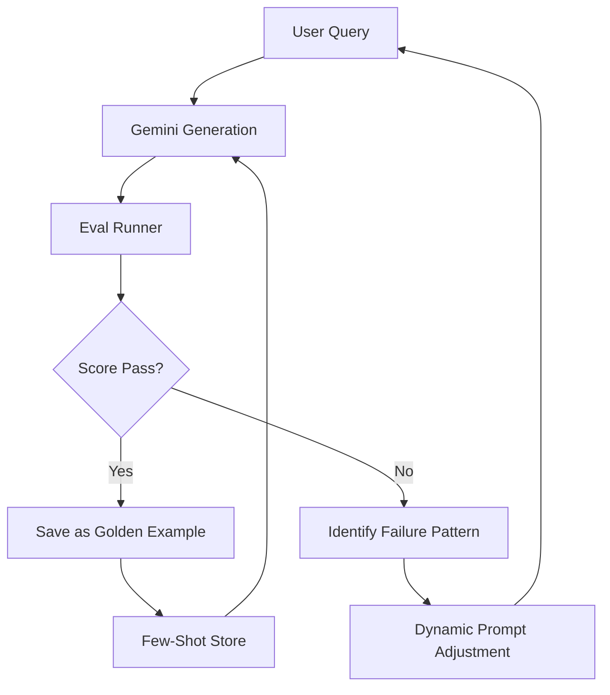

# Forbes Quill: Self-Improvement & Learning Pipeline

To move beyond static prompts and one-off evaluations, we are implementing a **Learning Loop**. This ensures that every evaluation failure becomes a data point for system optimization.

## 1. The Feedback Architecture
The system will now follow a **Generate -> Evaluate -> Learn -> Refine** cycle.

## 2. Components

### A. Feedback Capture (API + UI)
- **UI**: Add "Approve" and "Edit & Save" actions to every output card.
- **Backend**: `/api/feedback` endpoint to save "Perfect" articles to a `feedback_store`.

### B. Dynamic Few-Shot Injection
- The prompt constants in [lib/prompts.ts](file:///Users/adi7192/Documents/Forbes%20MVP/quill/lib/prompts.ts) will now include a placeholder for `${EXAMPLES}`.
- API routes will fetch the top 2-3 highest-scoring "Approved" articles from the `feedback_store` that match the current query's intent and inject them.

### C. Automated Refinement (Loop)
- If the Eval Runner scores an output below a threshold (e.g., < 70%), the API can trigger a **"Correction Pass"**.
- This pass sends the original prompt + the failed output + the evaluation report back to Gemini with the instruction: *"Fix the following specific failures [list of failures] from the previous draft."*

## 3. Implementation Plan
1. **[NEW]** `/api/learning/feedback`: Endpoint to log user-vetted content.
2. **[UPDATE]** [lib/prompts.ts](file:///Users/adi7192/Documents/Forbes%20MVP/quill/lib/prompts.ts): Add `DYNAMIC_EXAMPLES` pattern.
3. **[UPDATE]** [app/api/article/route.ts](file:///Users/adi7192/Documents/Forbes%20MVP/quill/app/api/article/route.ts): Implement the 2-step "Critique & Refine" logic if eval-logging is enabled.
4. **[NEW]** `evals/learning_curator.py`: A script to analyze `/results/` and summarize "common failures" into a monthly prompt-tuning brief.
